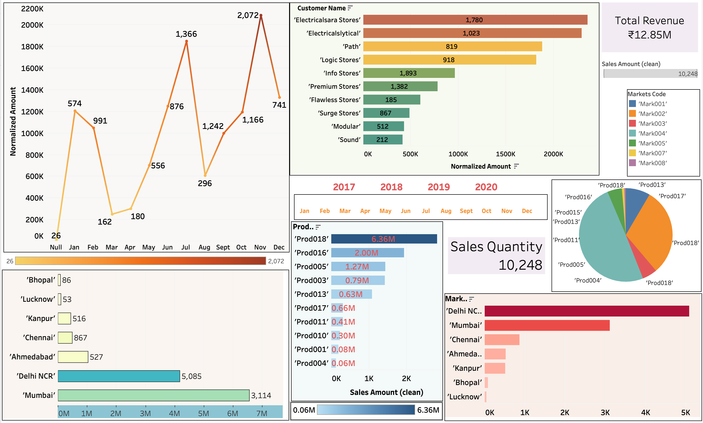

# 💻 Visualization of Sales and Market Dashboard - Tableau Project

This Tableau project simulates a real-world **data analysis scenario** in a company that sells computer hardware. The business faces challenges in a dynamically changing market, and the Sales Director has decided to invest in data-driven insights to improve strategic decision-making.

This project demonstrates how data analytics is executed in **large enterprises**, covering everything from database understanding, data modeling, and data cleaning, to dashboard visualization using **Tableau**.

---


## 📌 Problem Statement

The sales team of a computer hardware company is unable to make strategic decisions due to a lack of visibility into key metrics such as **sales trends**, **top-performing markets**, and **customer behavior**. They want to develop a **Tableau dashboard** that can:
- Provide **real-time sales insights**.
- Help identify **top customers and products**.
- Understand sales distribution across **markets** and **time**.

---


## 🖼️ Screenshots

> You can add screenshots of your Tableau dashboard here for better presentation.
> 


---


## 🧩 Database Overview

The project uses a relational database schema, consisting of 5 tables. Below is the schema used for the analysis:

### 1. `customers`
- `Customer Name`
- `Customer Type`
- `Customer Code`
- `Customers (Count)`

### 2. `data`
- `Cy Data`
- `Date`
- `Date (clear)`
- `Date Yy Mmm`
- `Month Name`
- `Month Name (clear)`
- `Year`
- `Date (Count)`

### 3. `markets`
- `Market Code`
- `Market Name`
- `Zone`
- `Markets (Count)`

### 4. `products`
- `Product Code`
- `Product Type`
- `Products (Count)`

### 5. `transactions` *(Fact Table)*
- `Currency`
- `Customer Code`
- `Market Code`
- `Order Date`
- `Product Code`
- `Sales Amount`
- `Sales Quantity`
- `Normalized Amount`
- `Sales Amount (clean)`
- `Transaction (Count)`

---


## 🌟 Project Workflow

Here are the key steps followed to complete the project:

1. **Understanding the Problem Statement**  
   Analyzed the business goals and data requirements.

2. **Database Understanding**  
   Reviewed all tables and fields to identify relationships.

3. **Database Connection**  
   Connected SQL Workbench database to Tableau.

4. **Data Modeling**  
   Designed a **Star Schema**, identifying `transactions` as the fact table and the rest as dimension tables.

5. **Data Cleaning and Normalization**  
   - Removed formatting issues (e.g., strings in numerical columns).
   - Normalized currency values for unified insights.

6. **Sheet Creation**  
   Built Tableau sheets as per KPIs required.

7. **Dashboard Development**  
   Created an **interactive dashboard** using charts, KPIs, and filters for dynamic exploration.

---


## 📊 Key Visualizations

The dashboard includes the following insights:

1. **Total Revenue**
2. **Total Sales Quantity**
3. **Revenue by Market**
4. **Sales Quantity by Market**
5. **Top Customers**
6. **Top Products**
7. **Revenue by Year and Month**
8. **Product Quantity Sales by Market**

---


## 📁 Project Structure

📦 computer-hardware-sales-dashboard
│
├── data/
│ └── sample_data.sql (or .csv files, optional)
│
├── dashboard/
│ └── dashboard.twbx (Tableau packaged workbook)
│
├── images/
│ └── dashboard_screenshot.png
│
└── README.md


---


## 🛠 Tools & Technologies

- **Tableau** – for data visualization  
- **MySQL Workbench** – database setup and connection  
- **SQL** – data extraction and transformation  
- **Data Modeling** – Star schema  
- **Data Cleaning & Normalization** – using Tableau calculated fields  
- **Visualization Best Practices**


---


## ⚙️ How to Run This Project

1. Clone this repository:
   ```bash
   git clone https://github.com/your-username/computer-hardware-sales-dashboard.git
2. Open Tableau and connect to:

	* MySQL Workbench (if using a live database)

	* OR directly open the .twbx file provided

3. Explore individual sheets and dashboard

   
---


💡 Outcome
* Helped business users monitor revenue and quantity trends
* Identified top-performing customers and products
* Delivered year-wise and market-wise insights
* Made data-driven decision-making easier with interactive dashboards

---


📬 Contact
Sàyáñ Måîty
📧 Email: gypsum1010@gmail.com
🔗 LinkedIn: www.linkedin.com/in/sàyáñ-måîty-aa55a61b3

📌 Acknowledgments
Thanks to Tableau for enabling powerful data storytelling.
Inspired by real-world business intelligence challenges.


